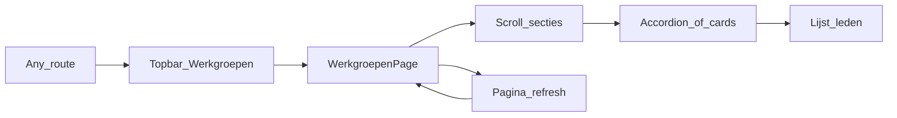

# Plan: Werkgroepen- en organisatieoverzicht

## Context (Phase 1)

- **Branch:** [`git status`] toont `experimental` — ontwikkeling is toegestaan (niet `main`).
- **Risico:** Laag — alleen frontend, geen database, geen Edge Functions, geen secrets.
- **Bestaande app:** Minimale shell: `[src/App.tsx](src/App.tsx)` (lazy routes), `[src/layouts/MainLayout/MainLayout.tsx](src/layouts/MainLayout/MainLayout.tsx)`, `[src/components/common/Topbar.tsx](src/components/common/Topbar.tsx)`, MUI + thema in `[src/shared/theme/defaultTheme.ts](src/shared/theme/defaultTheme.ts)`. Geen bestaande werkgroepen-code.

## Jouw beslissingen (gedocumenteerd)

| Vraag           | Jouw antwoord                                                                       |
| --------------- | ----------------------------------------------------------------------------------- |
| Scope           | Alles: Bestuur, Kerngroep, alle werkgroepen, Campagnecommissie + Programmacommissie |
| E-mail/telefoon | Placeholders tonen zodat de layout vaststaat                                        |

**Designoptie (workflow 2.4):** **Optie C — minimale uitbreiding:** nieuwe feature-map met types + statische data-service + presentatie-componenten + pagina + route + topbar-link. Geen backend tenzij later gewenst.

## User journey (Phase 2.1.1) — kort

- **Entry:** Gebruiker opent `/werkgroepen` (direct of via topbar).
- **Auth:** Geen login vereist (informatieve pagina); gedrag hetzelfde voor ingelogd/uit.
- **Fouten/netwerk:** Geen API — geen laadfouten; alleen eventuele app-level error boundary (bestaand).
- **Refresh / navigatie weg:** Statische content blijft identiek.
- **Cross-feature:** Geen koppeling met auth-state behalve wat globaal al in layout zit.

*(Bevestig in een volgende chat als je auth-gating of “alleen voor leden” later wilt.)*

## Datamodel (objectief, flexibel voor Bestuur vs werkgroep)

De bron noemt voor **werkgroepen** expliciet rollen “voorzitter” en “lid”; voor **bestuur** zijn de functietitels (Voorzitter, Organisatiesecretaris, Penningmeester) inhoudelijk rollen. Eén plat model houdt de UI eenvoudig:

- `**OrganisatieGroep`:** `id`, `title`, `description` (lange tekst; eventueel met subtaken als optionele `string[]` waar nodig, bv. “Overige bestuurstaken”), `members: OrganisatieLid[]`, `iconKey` (interne sleutel voor gekozen MUI-icon).
- `**OrganisatieLid`:** `name`, `email`, `phone` (placeholders zoals `"Nog te vullen"` waar geen data), `**roleLabel: string`** (bijv. `"Voorzitter"`, `"Lid"`, `"Organisatiesecretaris"`, `"Penningmeester"`), optioneel `note` voor toelichtingen zoals “website plaatsingen”.

**Kerngroep:** leden leeg of één placeholder-regel met `roleLabel` conform “ntb” — afstemming met jouw voorkeur in implementatie (leeg met korte zin vs. placeholder-lid).

**Tijdelijk (Campagnecommissie, Programmacommissie):** groepen met korte beschrijving, `members: []` mogelijk.

**Inhoudelijke inconsistentie in bron:** Onder “Werkgroep Massalijn” staat tekst over politieke monitoring. In de data gebruiken we de titel die jij gaf; de beschrijving volgt jouw geplakte tekst. Als de titel moet worden “Politieke monitoring” i.p.v. Massalijn, kan dat in één data-edit.

## Architectuur (Phase 3)

| Laag          | Keuze                                                                                                                                                                                                                                                                                                                                                          |
| ------------- | -------------------------------------------------------------------------------------------------------------------------------------------------------------------------------------------------------------------------------------------------------------------------------------------------------------------------------------------------------------- |
| **Types**     | `[src/features/werkgroepen/types/](src/features/werkgroepen/types/)` — `werkgroepen.types.ts`                                                                                                                                                                                                                                                                  |
| **Data**      | `[src/features/werkgroepen/services/werkgroepenStaticData.ts](src/features/werkgroepen/services/werkgroepenStaticData.ts)` — export van gestructureerde arrays + evt. `getOrganisatieSections()` zonder React                                                                                                                                                  |
| **Hook**      | `[src/features/werkgroepen/hooks/useWerkgroepenData.ts](src/features/werkgroepen/hooks/useWerkgroepenData.ts)` — dunne wrapper (`useMemo`) rond statische data voor consistentie met de rest van de app                                                                                                                                                        |
| **UI**        | `[src/features/werkgroepen/components/](src/features/werkgroepen/components/)` — o.a. sectie met `Typography`/`Accordion`/`Card`, `List`/`ListItem`/`ListItemText` of `Table` voor leden, `Chip` voor rol, `@mui/icons-material` voor iconen (mapping `iconKey` → icon component in een kleine helper of switch in de hook — **geen** icon-imports in `types`) |
| **Page**      | `[src/pages/Werkgroepen/WerkgroepenPage.tsx](src/pages/Werkgroepen/WerkgroepenPage.tsx)` — compositie: intro + gegroepeerde secties                                                                                                                                                                                                                            |
| **Routing**   | `[src/App.tsx](src/App.tsx)` — lazy import + `<Route path="/werkgroepen" … />` binnen `MainLayout`                                                                                                                                                                                                                                                             |
| **Navigatie** | `[src/components/common/Topbar.tsx](src/components/common/Topbar.tsx)` — link naar `/werkgroepen` (zelfde patroon als Setup)                                                                                                                                                                                                                                   |

**Importrichting:** `pages` → `features/werkgroepen` (hooks/components); services importeren geen components/hooks.

**Styling:** Geen `sx` voor kleuren tenzij bestaand patroon; layout/spacing via `sx` waar nodig; **geen** thema-tokenwijziging zonder jouw expliciete akkoord (projectregel).

**Complexiteit:** Logica splitsen in kleine functies (icon-map, rij-render) zodat cyclomatische/cognitieve limieten gehaald blijven.

## UI-richting (MUI)

- **Pagina:** `Container` + duidelijke `h1` + optioneel `Divider` tussen hoofdsecties.
- **Lange teksten:** Per groep `Accordion` (samenvatting = titel + icoon) of `Card` met ingeklapte details — voorkomt eindeloze scroll; sub-taken (media, traditionele media, …) als geneste `List` of `Typography` met kopjes waar de content dat vraagt.
- **Leden:** Tabel of responsieve lijst met kolommen/koppen: naam, rol, e-mail (`Link` `mailto:` als het geen placeholder is — of altijd tonen met placeholder), telefoon (`tel:` alleen bij echte nummers later).
- **Iconen:** Vaste set uit `@mui/icons-material` (bijv. `Groups`, `Campaign`, `Forum`, …) per groep.

## Bestaande functionaliteit (Phase 2.2)

- Geen herbruikbare “org chart”-component; **nieuwe** feature-componenten.
- Patronen overnemen: lazy route + `PageLoadingState`, MUI-typografie, `[MainLayout](src/layouts/MainLayout/MainLayout.tsx)` container.

## Validatie na implementatie (Phase 5)

- `pnpm lint`
- `pnpm validate:structure`
- `pnpm arch:check`

## Documentatie (Phase 5–7)

- `[src/features/werkgroepen/README.md](src/features/werkgroepen/README.md)` — doel, structuur, waar data te wijzigen.
- Bij user-facing wijziging: `[CHANGELOG.md](CHANGELOG.md)` + `package.json` `version` synchroon (MINOR voor `feat:`).

## Handmatige testchecklist (Phase 6)

- `/werkgroepen` laadt; topbar-link werkt.
- Alle secties zichtbaar; lange beschrijvingen leesbaar (accordion/cards).
- Leden tonen naam, rol, placeholders voor contact.
- Responsive: geen horizontale overflow op smalle viewport.
- Toetsenbord: Accordion-koppen focusable (MUI default).

## Wat we bewust niet doen in deze fase

- Geen Supabase-tabellen of migraties.
- Geen CMS — content wijzigen = TypeScript-data aanpassen.
- Geen organogram-visualisatie als grafiek (alleen tekst “visualiseren van organogram” in intro tenzij je later uitbreidt).

