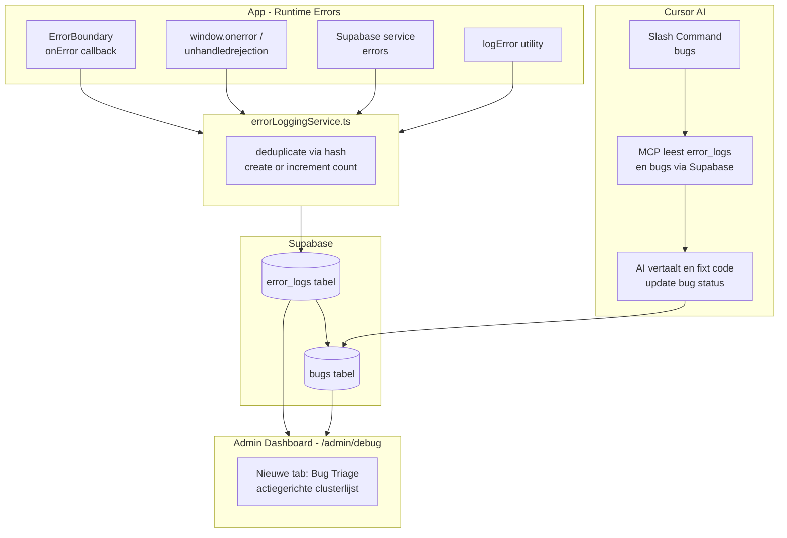

# App Error Logging & AI Fix Systeem (Streamline)

## Architectuur

## Fase 1 — Supabase Schema (Streamline)

Twee nieuwe tabellen via een migratie in `supabase/migrations/`:

`**error_logs**` — dedup-clusters + telling:

- `id`, `hash` (uniek), `message`, `stack`, `context`, `type`, `route`, `user_id`, `browser_info`, `count`, `first_seen_at`, `last_seen_at`, `app_version`, `status` (open / muted / resolved)

`**bugs**` — gegroepeerde / bevestigde bugs (beheerd door Cursor):

- `id`, `title` (mensentaal), `description`, `status` (open / in_progress / fixed), `priority`, `fix_notes`, `created_at`, `updated_at`

`**bug_error_hashes**` — relatie: 1 bug naar meerdere error-hashes:

- `id`, `bug_id` (FK), `error_log_id` (FK), `created_at`

RLS: enkel `service_role` kan schrijven naar `error_logs`. Admin-users kunnen `bugs` lezen en updaten.

Retentie: `error_logs` records ouder dan **90 dagen** worden verwijderd via scheduled cleanup.

## Fase 2 — `errorLoggingService.ts`

Nieuw bestand: `src/shared/services/errorLoggingService.ts`

- `logAppError(error, context, type, metadata)` — hoofdfunctie
- Genereert een **hash** op basis van `message + stack + context` (geen externe lib nodig, simpele checksum)
- Doet een Supabase **upsert op hash**: als de error al bestaat → `count++` en `last_seen_at` updaten; nieuw → insert
- Voegt toe: huidige route (`window.location.pathname`), `user_id` uit Supabase auth, browser info
- Faalt **stilletjes** (geen recursieve logging) — wrap in `try/catch` zonder re-throw
- Conditie: alleen loggen in productie + staging (niet in `import.meta.env.DEV`)

## Fase 3 — Error Sources aansluiten (bestaande bronnen eerst)

Prioriteit: **bestaande error-bronnen** first, dan nieuwe.

**3a. `ErrorBoundary.tsx`**

- `componentDidCatch` uitbreiden: roept `logAppError(error, errorInfo.componentStack, 'react_boundary')` aan
- Bestaande `console.error` blijft staan

**3b. `window.onerror` + `unhandledrejection` global handler**

- Nieuw bestand: `src/shared/utils/globalErrorHandler.ts`
- Registreert `window.addEventListener('unhandledrejection', ...)` en `window.onerror`
- Aanroepen in `src/main.tsx` (één keer, bij app start)

**3c. `logError` utility in `src/shared/utils/errorHandling.ts`**

- De bestaande `logError()` functie roept nu ook `logAppError()` aan
- Zo worden alle plekken die al `logError()` gebruiken automatisch meegenomen

**3d. Supabase service errors (fase 2, gericht)**

- Koppel eerst bestaande `console.error` hotspots in kernservices naar `logError` of `logAppError`
- Geen brede client wrapper in v1; alleen gerichte koppeling op plekken waar nu al fouten worden gelogd

## Fase 4 — Admin Debug Dashboard Tab (Bug Triage)

Bestaand bestand: `src/pages/admin/debug/DebugToolsPage.tsx`

- Voeg een **nieuwe tab "Bug Triage"** toe aan de bestaande debug pagina
- Toont geclusterde `error_logs` gesorteerd op `count desc`, daarna `last_seen_at desc`
- Per rij: korte mensentaal titel (indien bekend), context-tag, count badge, type chip, last seen
- Detailpaneel toont stack, route, browser info en gekoppelde bugstatus
- Eenvoudige prioriteit-state op bugniveau (laag / normaal / hoog / kritisch), zonder drag-and-drop
- Realtime via Supabase `channel().on('postgres_changes', ...)` subscription

## Fase 5 — Cursor Slash Command Instructie (`/bugs`)

Nieuw bestand: `.cursor/instructions/bugs.md`

Dit is een **Cursor Slash Command** instructie die de developer handmatig aanroept met `/bugs`. De instructie beschrijft:

1. Gebruik Supabase MCP om open `error_logs` clusters op te halen (`count desc`, `last_seen_at desc`)
2. Vertaal clusters naar mensentaal en stel bug-titels voor
3. Laat gebruiker prioriteit kiezen voor de top-clusters
4. Maak/werk `bugs` records bij en koppel meerdere hashes via `bug_error_hashes`
5. Voor geselecteerde bug: analyseer stack + code, pas de fix direct toe
6. Werk `bugs.status` en `fix_notes` bij
7. Zet gerelateerde `error_logs.status` op `resolved` waar passend

## Bestandsoverzicht

- `supabase/migrations/[timestamp]_add_error_logging.sql` — nieuw
- `src/shared/services/errorLoggingService.ts` — nieuw
- `src/shared/utils/globalErrorHandler.ts` — nieuw
- `src/main.tsx` — aanpassen (global handler registreren)
- `src/components/common/ErrorBoundary.tsx` — aanpassen
- `src/shared/utils/errorHandling.ts` — aanpassen (`logError` koppelen)
- `src/pages/admin/debug/DebugToolsPage.tsx` — aanpassen (Bug Triage tab toevoegen)
- `src/features/admin/debug/` — nieuwe componenten voor de bug log UI
- `.cursor/instructions/bugs.md` — nieuw (slash command instructie)

## Finish regel (nieuwe functionaliteit check, verplicht)

Na implementatie: controleer of nieuwe features/hooks/services die errors gooien de `logError` utility gebruiken (of direct `logAppError`). Als een nieuwe service `console.error` gebruikt zonder `logError`, is het niet aangesloten op dit systeem en moet het alsnog gekoppeld worden.